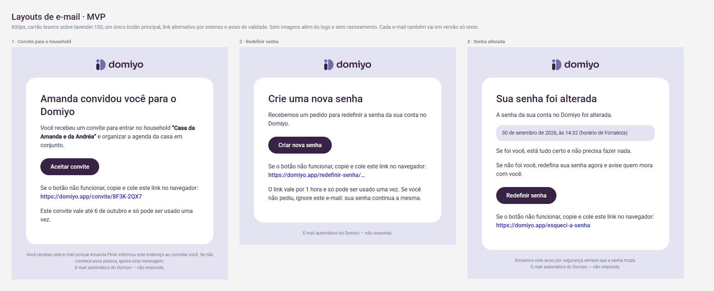

# Transactional emails (MVP)

**Status:** Layout and copy proposed on 2026-09-30, for product owner review. Rules: `docs/DESIGN_SYSTEM.md` › "Email templates". Delivery: `docs/ARCHITECTURE.md` › "Email delivery".

`emails-preview.html` is a visual reference only (it loads web fonts and uses modern CSS). The production templates must be rebuilt with tables and inline styles, with a plain-text version of each email.

Values in `{braces}` are filled by the API. Links always use `APP_PUBLIC_URL`. Dates use the pt-BR format and the MVP time zone (`America/Fortaleza`).

## 1. Household invitation

- **Subject:** `{inviter_first_name} convidou você para o Domiyo`
- **Title:** `{inviter_first_name} convidou você para o Domiyo`
- **Body:** "Você recebeu um convite para entrar no household **“{household_name}”** e organizar a agenda da casa em conjunto."
- **Button:** "Aceitar convite" → `{invite_url}`
- **Fallback:** "Se o botão não funcionar, copie e cole este link no navegador:" + `{invite_url}`
- **Expiry note:** "Este convite vale até {expiry_date} e só pode ser usado uma vez."
- **Footer:** "Você recebeu este e-mail porque {inviter_full_name} informou este endereço ao convidar você. Se não conhece essa pessoa, ignore esta mensagem." / "E-mail automático do Domiyo — não responda."

## 2. Password reset

Sent only when the address belongs to an account; the screen always shows the same neutral message (no account discovery).

- **Subject:** "Redefina sua senha do Domiyo"
- **Title:** "Crie uma nova senha"
- **Body:** "Recebemos um pedido para redefinir a senha da sua conta no Domiyo."
- **Button:** "Criar nova senha" → `{reset_url}`
- **Fallback:** same sentence as above + `{reset_url}`
- **Expiry note:** "O link vale por 1 hora e só pode ser usado uma vez. Se você não pediu, ignore este e-mail: sua senha continua a mesma."
- **Footer:** "E-mail automático do Domiyo — não responda."

## 3. Password changed

Security notice sent after any password change.

- **Subject:** "Sua senha do Domiyo foi alterada"
- **Title:** "Sua senha foi alterada"
- **Body:** "A senha da sua conta no Domiyo foi alterada." + highlighted box "{changed_at_date}, às {changed_at_time} (horário de Fortaleza)" + "Se foi você, está tudo certo e não precisa fazer nada." + "Se não foi você, redefina sua senha agora e avise quem mora com você."
- **Button:** "Redefinir senha" → `{app_url}/esqueci-a-senha`
- **Footer:** "Enviamos este aviso por segurança sempre que a senha muda." / "E-mail automático do Domiyo — não responda."

## Not decided yet

- Sending domain and sender address (depend on the provider and the domain).
- The 1-hour reset validity is a proposal to confirm (the "Esqueci a senha" screen copy also says "O link vale por 1 hora").
- Logo hosting: a PNG of the light logo served from the app domain.
