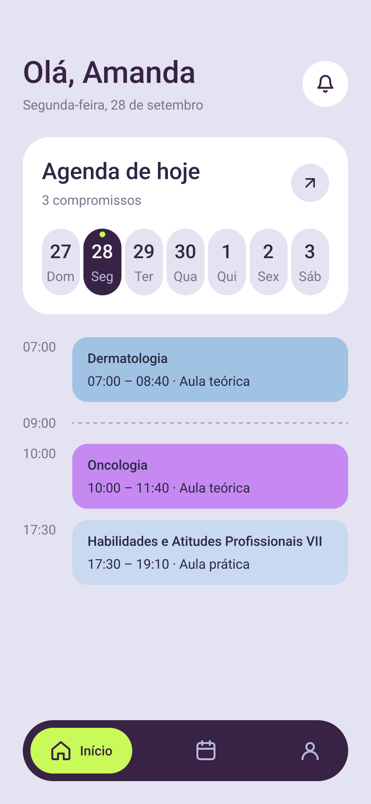
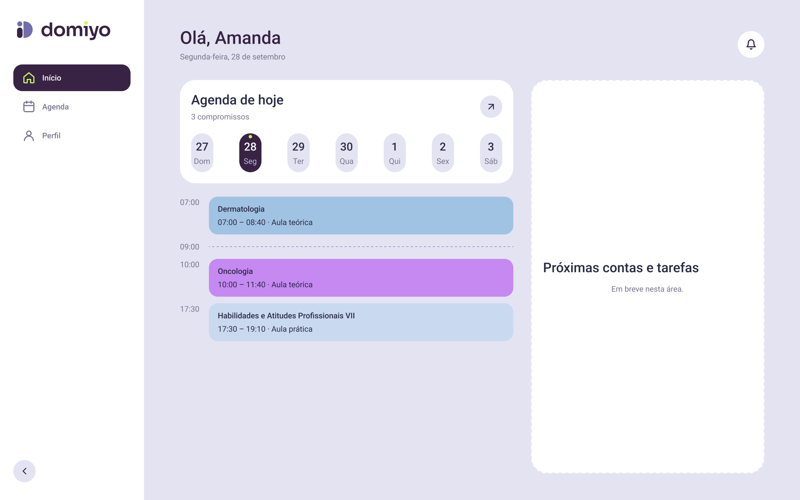
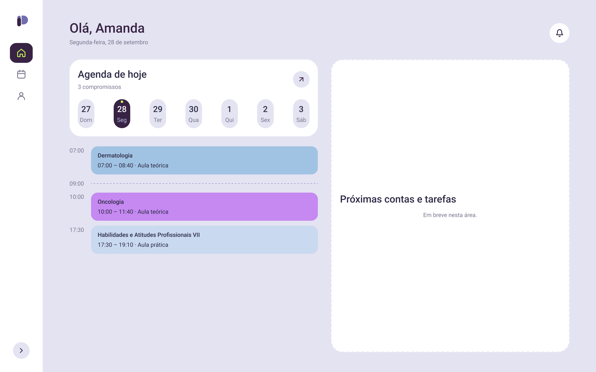
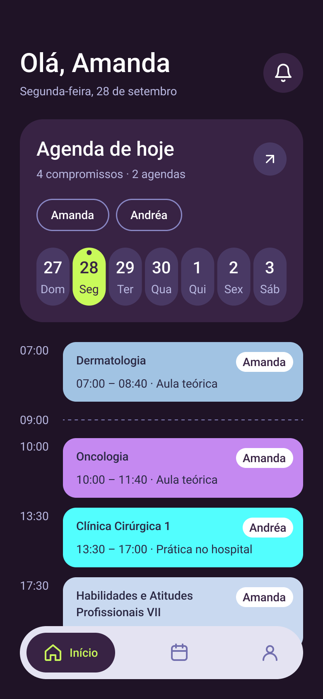

# Início (Home) — mobile

**Status:** First draft for product owner review (2026-09-28). Figma page "Início", frame "Início / Mobile" (390×844), component set "Barra de navegação".

## Scope (MVP)

The MVP home shows only the logged-in user's name and today's agenda items. Upcoming bills, tasks, meals, and grocery gaps will be added to this screen later (see `docs/PRD.md`).

## Structure

1. **Header:** "Olá, {primeiro nome}" (Page Title, `lavender.900`) + full date in pt-BR (Body Small, `ink.600`) + notifications bell button (48px, `white`, `radius.full`).
2. **"Agenda de hoje" card** (`white`, `radius.xl`, padding 20, gap 20):
   - Title (Section Heading) + summary "{n} compromissos" (Body Small) + a 40px round button that opens the Agenda screen.
   - No agenda filter: Início shows only the logged-in user's own agenda (product owner decision, 2026-09-29). Filtering across household agendas lives on the Agenda screen.
   - Week strip: 7 day pills (40px wide, `lavender.100`, `radius.full`), number in Numeric Emphasis and weekday in Body Small. The selected day uses `lavender.900` with white number, `lavender.300` weekday, and a 6px `lime.500` dot. Tapping a day changes the timeline below.
3. **Timeline** (outside the card, to avoid nested cards): one row per item, time label (Body Small, `ink.600`, 40px column) + item card. Free slots between items show the hour with a dashed `lavender.600` divider.
   - **Item card:** fill = subject color (see below), `radius.md`, padding 12/16. Subject name (Label, `ink.900`), then "{início} – {fim} · {tipo}" (Body Small, `ink.900`).
   - **No owner avatar on Início:** every item belongs to the logged-in user, so the owner indicator is omitted here. The Agenda screen, which can combine agendas, shows the owner with the "Avatar mini" component (24px, white, `lavender.900` initials of first name + surname, or the profile photo). Ownership is never shown by color, because color encodes the subject (PRD).
4. **Bottom navigation:** floating bar, `lavender.900`, `radius.full`, 24px from the screen edges. Active item is a `lime.500` pill with icon + label; inactive items are icon-only in `lavender.300` (code must give them accessible names). Variants: `Ativo=Início | Agenda | Perfil` × `Tom=Escuro | Claro` (the light-toned bar is used on the dark theme). UI copy uses "Início" (pt-BR) for the item the owner called "Home".

## Subject colors

Figma variable collection `Disciplinas` holds the 12 colors from the legend at the top of the current cronograma PDF (sampled from the owner's screenshot). `ink.900` text on each passes WCAG AA (lowest ≈5.5:1, Oncologia).

| Variable | Hex |
| --- | --- |
| `disciplina/dermatologia` | `#A1C3E3` |
| `disciplina/hematologia` | `#F3CCAE` |
| `disciplina/oncologia` | `#C589F1` |
| `disciplina/acoes-integrais-em-saude-vii` | `#FCB8FC` |
| `disciplina/terapia-intensiva` | `#AACF91` |
| `disciplina/habilidades-e-atitudes-profissionais-vii` | `#C9D9F0` |
| `disciplina/communicative-english` | `#CCCCCC` |
| `disciplina/eletivos` | `#FCFF43` |
| `disciplina/infectologia` | `#FDF2CE` |
| `disciplina/geriatria` | `#E3EFDA` |
| `disciplina/clinica-cirurgica-1` | `#52FEFE` |
| `disciplina/clinica-cirurgica-2` | `#44FD3E` |

**Decided (2026-09-30):** these colors are only the sample from this semester's PDF. In the product, each subject's color comes from the legend of the imported PDF (stored as data with the import); the `Disciplinas` collection is a design sample, not a token set.

## Desktop

Figma frame "Início / Desktop" (1440×900). Breakpoints are decided in `docs/DESIGN_SYSTEM.md` › "Breakpoints": the desktop shell starts at 768 px (sidebar collapsed from 768 to 1023 px, expanded from 1024 px).

- **Persistent sidebar** (260px, `white`, `line` right border) replaces the mobile bottom bar: logo, then the same three destinations stacked vertically. The active item is a `lavender.900` pill with a `lime.500` icon, matching the bottom bar's active state; inactive items are icon + label in `ink.600`.
- **Header and "Agenda de hoje" card** are the same components as mobile, just placed in a wider canvas — no new patterns.
- **Two-column body:** the agenda card and timeline keep a readable fixed width (600px) instead of stretching full-bleed (per "avoid a marketing landing page" / scanability). The remaining space is a second column, currently an empty dashed placeholder ("Próximas contas e tarefas — Em breve nesta área.") reserving room for the bills/tasks summaries the PRD defers past this MVP slice, so adding them later doesn't require re-flowing this layout.
- Item cards, chips, week strip, and the dark-theme mapping all apply unchanged — only the shell (sidebar vs. bottom bar, column width) is desktop-specific.
- **Decided (2026-09-30):** the layout switches from the bottom-bar shell to the sidebar shell at 768 px. **Not decided:** what fills the second column first (likely next bill + next task, per the PRD's home dashboard requirements) — this needs a product decision before that area is implemented.

### Collapsible sidebar

The sidebar can retract to an icon-only rail. Frame "Início / Desktop / Sidebar retraída" shows the collapsed state next to the expanded one ("Início / Desktop").

| Expanded (260px) | Collapsed (104px) |
| --- | --- |
|  |  |

- A `lavender.100`, `radius.full` chevron button pins to the bottom of the sidebar (via a `FILL`-height spacer above it) and toggles the state; the chevron points left when expanded (retract) and right when collapsed (expand).
- Collapsed, the wordmark hides and only the "Ponto + D" symbol remains, centered; nav items become icon-only, still centered, keeping the same active-state pill (`lavender.900` fill, `lime.500` icon).
- The content area reflows to use the freed width (the agenda column keeps its fixed 600px width and the second column fills the rest; neither is pinned to the sidebar's width), so collapsing is a live layout change, not an overlay.
- **Not designed:** the icon-only nav items need an accessible name and a hover tooltip (icons alone aren't a label) once this becomes code; the expand/collapse transition should respect `prefers-reduced-motion`; and whether the collapsed state persists per user (e.g. `localStorage`) or resets every session is an open decision.

## Dark theme

Figma frame "Início / Mobile / Escuro". **Approved by the product owner on 2026-09-30.** The original palette had no dark background or surface (`ink.900` and `lavender.900` have almost the same luminance, ≈1.01:1), so the dark theme adds two primitives, still in the Figma collection named `Proposta · Tema escuro` (rename it to `Tema escuro` in the Figma UI; the plugin cannot rename collections):

| Token | Hex | Derivation |
| --- | --- | --- |
| `lavender.950` | `#1F1326` | `lavender.900` darkened ~45%; screen background |
| `lavender.800` | `#493964` | `lavender.900` mixed 30% with `lavender.700`; raised controls |

| Element | Light | Dark |
| --- | --- | --- |
| Screen background | `lavender.100` | `lavender.950` |
| Card, bell button, chips | `white` | `lavender.900` |
| Day pills, "ver agenda" button | `lavender.100` | `lavender.800` |
| Primary text / icons | `ink.900` / `lavender.900` | `white` |
| Secondary text, time labels | `ink.600` | `lavender.300` |
| Selected day | `lavender.900`, white text, `lime.500` dot | `lime.500`, `lavender.900` text and dot |
| Navigation bar | `Tom=Escuro`: `lavender.900` bar, `lime.500` active pill with `lavender.900` icon/label, `lavender.300` inactive icons | `Tom=Claro`: `lavender.100` bar, `lavender.900` active pill with `lime.500` icon/label, `lavender.700` inactive icons (≈3.7:1) |
| Item cards, owner avatar | unchanged | unchanged (subject colors keep `ink.900` text) |
| Sheets, dialogs, side panels | `white` | `lavender.900`; scrim opacity 55% → 66% |
| Form inputs | `white`, `lavender.600` border | `lavender.950` inside app screens (`lavender.900` on the auth screens, whose card is `lavender.800`); border unchanged |
| Primary button | `lavender.900`, white label, `lime.500` arrow circle | `lime.500`, `lavender.900` label, `lavender.900` arrow circle with `lime.500` arrow |
| Secondary button | `white`, `lavender.600` border | transparent, `lavender.600` border, white label |
| Destructive button / text | `danger.600` (white label) | `danger.300` (`lavender.900` label); the error icon circle keeps `danger.100` with a `danger.600` icon |
| Selected option (radio row) | `lavender.100` fill, `lavender.900` border | `lavender.800` fill, `lime.500` border |
| Links | `Link` component, `Tema=Claro` | `Link` component, `Tema=Escuro` (`lime.500`) |
| Logo | light version: stem and text `lavender.900`, "D" and dots `lavender.700` | dark version (product owner decision, 2026-09-30): stem `lavender.300`, "D" and both dots `lime.500`, text white — as in `docs/DESIGN_SYSTEM.md` › Logo |
| Auth screens (login, sign-up, reset) | `lavender.500`→`lavender.300` gradient, `white` card | `lavender.900` background, `lavender.800` card, sun icon on the theme toggle |

The dark versions of every MVP screen (mobile and desktop) were generated from this mapping on 2026-09-30.

Contrast on dark: `white` on `lavender.950` ≈17.8:1; `lavender.300` on `lavender.950` ≈9.3:1, on `lavender.900` ≈7.4:1, on `lavender.800` ≈5.4:1; `lavender.600` chip/divider borders on `lavender.900` ≈4.2:1 (≥3:1 for UI components).

## Sample data

The screen uses sample items from the logged-in user's agenda ("Amanda"): Dermatologia, Oncologia, Habilidades e Atitudes Profissionais VII. They are placeholders, not real schedule data.

## Not yet designed

Loading, empty ("Nenhum compromisso hoje"), and error states; the day with no items.

Mobile navigation rules:

- Destinations use equal flexible slots. Icons stay centered in their own slots, independent of label width; inactive labels use `display: none`.
- An inactive link has a 50px hit area. The selected link and animated pill fill their slot, about 110px with the current three destinations at a 390px viewport; on narrower screens, they adapt to the available slot. The selected icon and label are centered together in icon-then-text order.
- Adding a destination redistributes the available width equally, so existing icon centers will move with their slots. The layout prevents label-driven shifts and overlap; it does not promise fixed screen coordinates when the destination count changes.
- Before adding destinations, confirm that the supported mobile widths still leave the active label readable and each inactive hit area at least 50px. If they do not, define an approved overflow/navigation pattern instead of allowing targets or labels to overlap.
- Reduced motion disables the pill animation.
